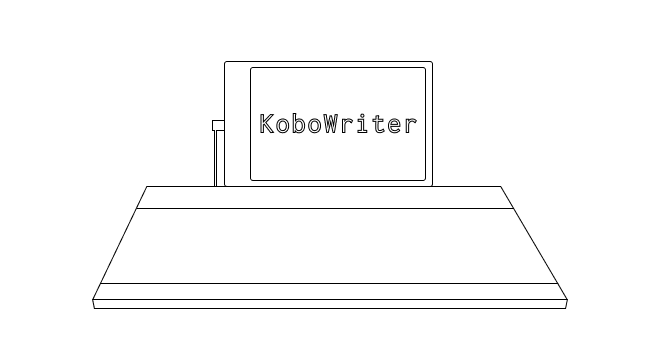
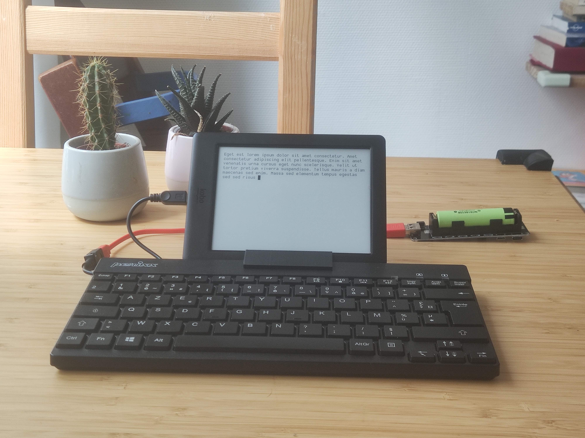
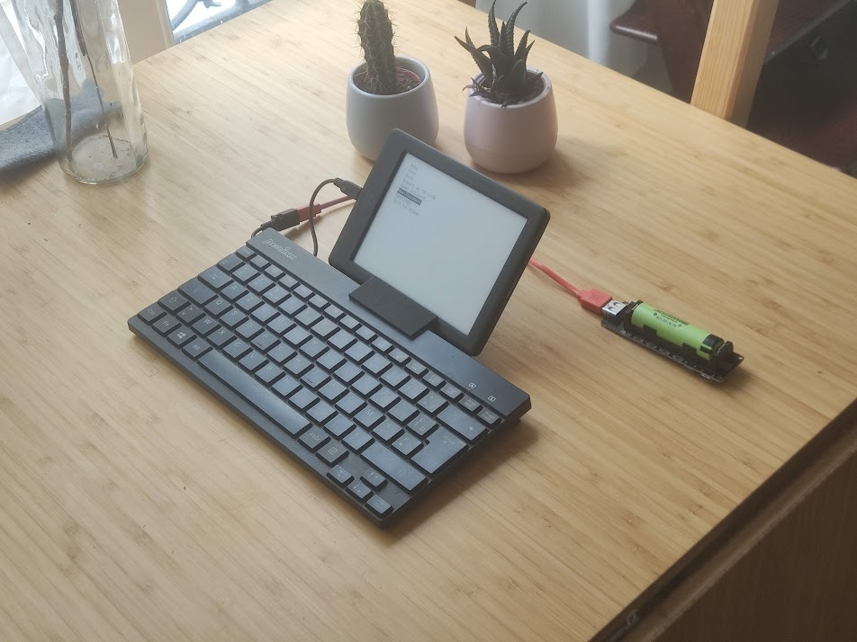

  

# Kobowriter

This small project aims to let you use your old KOBO e-reader (mine is a GLO HD) as a simple, distraction free typewriter.

For years I thought that e-ink was the ultimate medium to write in broad daylight without eye strain or focus fatigue. It seems that others have had the same ideas, as we can see in the [Freewrite](https://getfreewrite.com/) or [Pomera](https://www.kickstarter.com/projects/2132003782/pomera-pocket-typewriter-with-e-ink?ref=category_newest&amp;ref=discovery) products.

This project brings the same form factor in a considerably cheaper way (especially if like me you already have a KOBO at hand).

> Note that the installed software should let you switch between your normal kobo stock software and the KoboWriter one; so your kobo is still usable in its default way.

> Because XCSoar USB OTG should work for many KOBO devices (touch, Mini, Glo HD and pretty much all the later ones), this project would work there too. But as of now this program has only been built and tested for the KOBO GLO HD and supports QWERTY and AZERTY (French) keyboards.

## How it looks

## How it works

The kobo e-readers have a Micro-USB connector to charge and transfer files. With proper kernel modification this USB socket can be used as OTG, letting one plug in any kind of USB device.

Such kernel was compiled by the [XCSoar](https://github.com/XCSoar/XCSoar) project in order to turn the kobo into a flying assistant supported by an external GPS.

We use their modifications to connect a USB keyboard to the OTG port.

However, the kobo giving no power through its USB socket, the keyboard has to be powered on its own - you can either use a cheap USB otg power cable [like this one](https://www.amazon.com/AuviPal-Micro-USB-Cable-Power/dp/B07FY9Z9GD/ref=sr_1_3?crid=13TQ5BP3TUJT5&dchild=1&keywords=powered+usb+otg&qid=1630094365&sprefix=powered+%2Caps%2C536&sr=8-3) or modify the keyboard, like I did.

The software lets you use the keyboard to write and edit text files. It's coded in Go, compiled with a toolchain prepared for the KOBO devices, and relies largely on the excellent [FBInk](https://github.com/NiLuJe/FBInk) library to drive the screen, through its extremely useful port in Go, [go-fbink](https://github.com/shermp/go-fbink-v2).

Files are saved automatically inside a hidden folder `.adds/kobowriter/`. The config file and executable are stored here as well.

## How to build it

- Download the kobo build of [koxtoolchain](https://github.com/koreader/koxtoolchain/releases/tag/2021.12) on your development computer. This toolchain will let you build Go programs that can run on the Kobo.
- Extract the downloaded `kobo.zip` this will result in `kobo.tar.gz`
- Extract the `kobo.tar.gz` and place the resulting `x-tools` folder in the same folder as this `README.md` file.
- Open a terminal and run `make`

## How to install

You can build the software, put it on a KOBO with XCSoar software, and launch it any way you see fit.

> You do this at your own risk! 

If you do happen to brick your device, there's supposed to be a micro-SD card hidden inside the casing that contains two partitions, one for the firmware and one for your books (you only get to see this one while it's connected to your pc). This at least provides you an opportunity to revive your device, but you'll have to find instructions for this elsewhere.

### Installing the XCSoar launcher

- Download the `KoboRoot.tar.gz` from the [release page](https://github.com/olup/kobowriter/releases/tag/v0.0.1)
- Connect your Kobo and place the archive in the .kobo (hidden) directory
- eject safely, unplug, and let the Kobo update
  
From now on your Kobo will start up on XCSoar launcher. This build comes with an old prebuild version of kobowriter that uses an AZERTY keybaord layout. You can use this build to check if Kobowriter will work for you at all, as not all keyboards will function. Note that you need USB-OTG to be enabled to detect any keyboard at all.

### Installing a new build of kobowriter

- Start the stock Kobo software by pressing the *Nickel* button.
- Connect your Kobo again.
- Copy the `kobowriter` from your build folder to the hidden folder `.adds/kobowriter/` on your device, replacing the file that's already there.
- Eject safely, unplug, turn-off the device and then restart it.

### Starting kobowriter

- When the XCSoar launcher is started again, press the *System* button and press *Enable USB-OTG*.
- Press *Close* and then *Poweroff*.
- Turn the device on again.
- When XCSoar launcher is started, press *Tools* and then *KoboWriter* to start the text editor.
- Plugin you powered USB keyboard and you should be good to go ;-)
- Menu is accessed with the *escape* button. You can change the keyboard layout to QWERTY here, create a new document, open an old one, or close the software.

> Note that while USB-OTG is enabled, you won't be able to start the stock Kobo software. But you need to have it on in order to use the KoboWriter software. Changing the USB-OTG setting requires a restart. If you want to use your Kobo again as an e-reader, you have to *Disable USB-OTG*, turn the device off and on again and then press the *Nickel* button.

### Starting Kobo e-reader software
- Turn on your Kobo
- When the XCSoar launcher is started, press the *Nickel* button, or if that's grayed out, continue with the steps below.

- Press the *System* button and press *Disable USB-OTG*.
- Press *Close* and then *Poweroff*.
- Turn the device on again.
- When the XCSoar launcher is started, press the *Nickel* button

